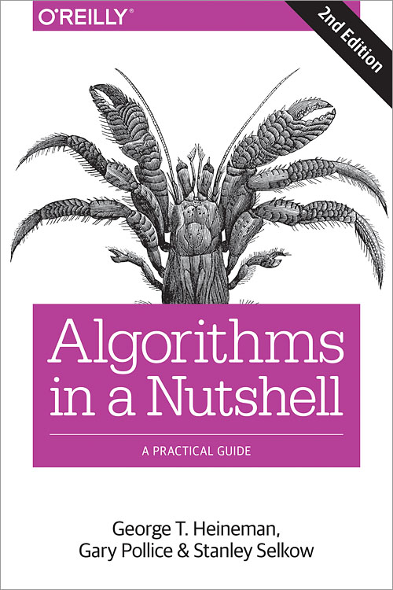

# Algorithms in a Nutshell

  
  
* **Publisher**  http://shop.oreilly.com/product/0636920032885.do  
* **Github**  https://github.com/heineman/algorithms-nutshell-2ed  

## Toc
* [Ch01 Thinking in Algorithms]()  
* [Ch02 The Mathematics of Algorithms]()  
* [Ch03 Algorithm Building Blocks]()  
* [Ch04 Sorting Algorithms]()  
* [Ch05 Searching]()  
* [Ch06 Graph Algorithms]()  
* [Ch07 Path Finding in AI]()  
* [Ch08 Network Flow Algorithms]()  
* [Ch09 Computational Geometry]()  
* [Ch10 Spatial Tree Structures]()  
* [Ch11 Emerging Algorithm Categories]()  
* [Ch12 Epilogue: Principles of Algorithms]()  